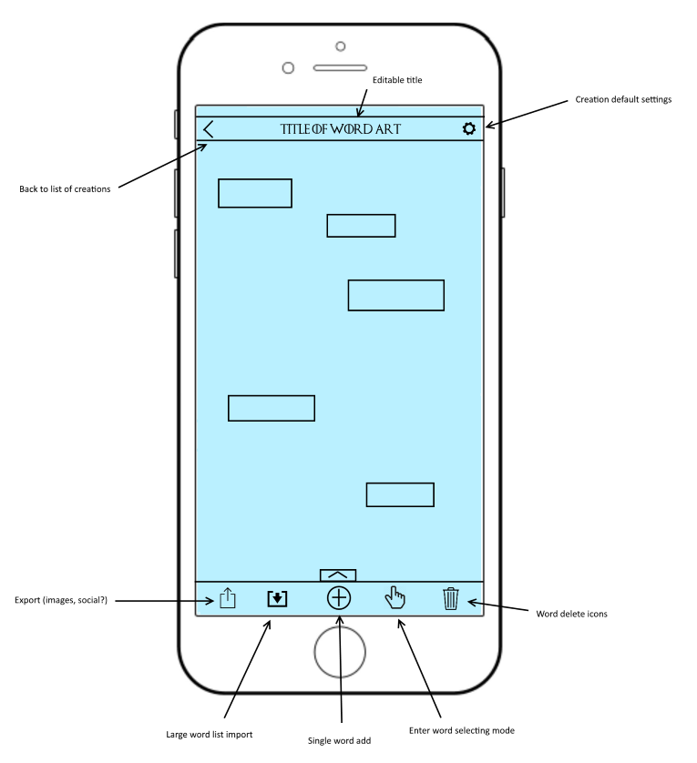
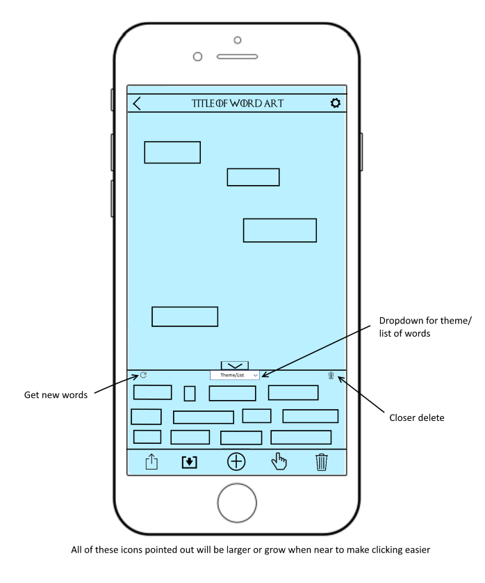
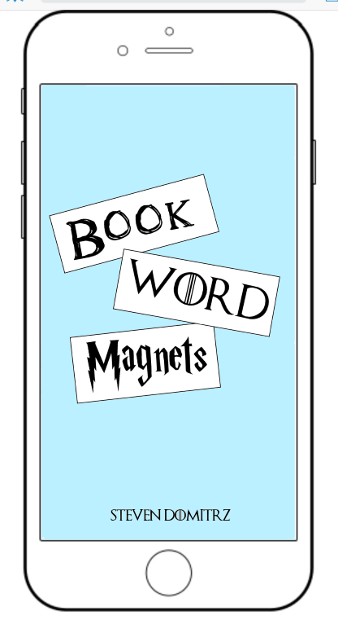
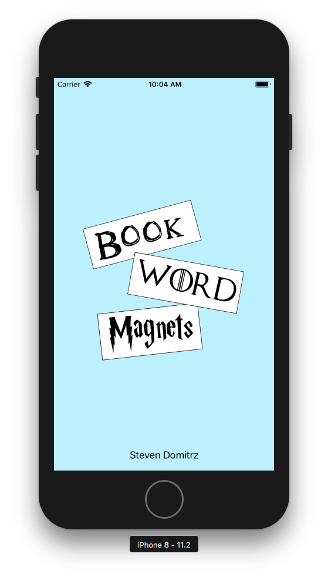
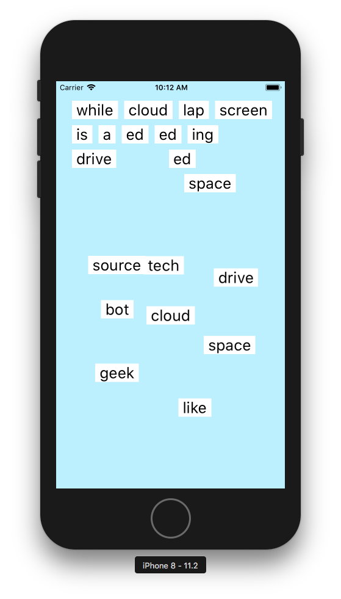
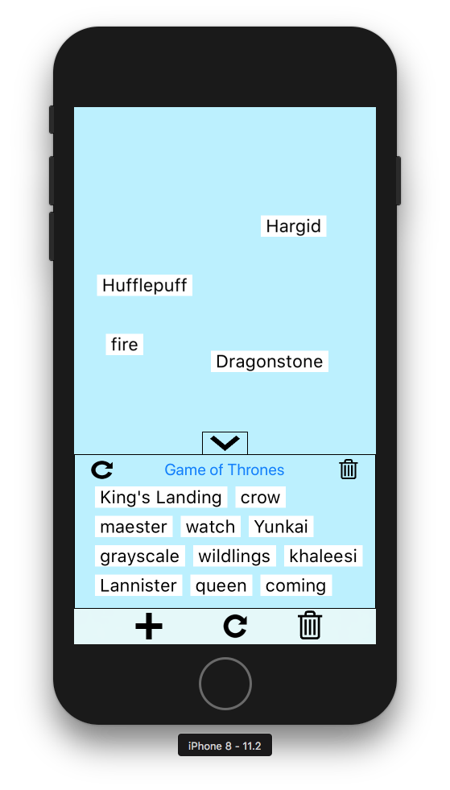
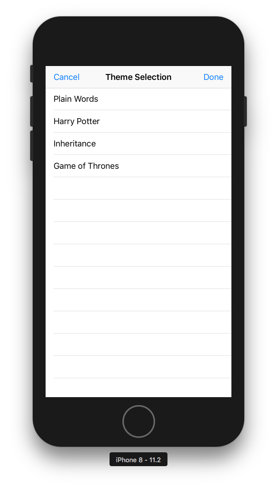
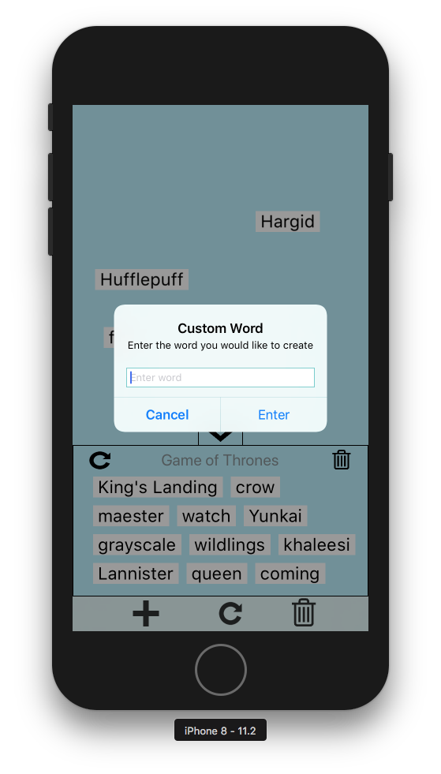

# Book Word Magnets
Steven Domitrz

A highly customizable word magnets app for iOS, with different book themes.

* [Checkpoint 1](#checkpoint-1)
* [Checkpoint 2](#checkpoint-2)
* [Checkpoint 3](#checkpoint-3)

## Features (Proposed)
1. Every word is customizable (font, color, size, etc.)
2. Lists of custom words can be imported easily
3. Ability to use custom backgrounds

## Checkpoint 1
### Features Completed
* Set of random words loaded on app start up
* Words can be dragged around the screen
* Basic start screen and App icon created

### Design Mockups

* Mockup of screen with word selection down, showing main icons

* Mockup of screen with word selection up

* Mockup of launch screen

### Screenshots

* Launch Screen

* Main Screen

## Checkpoint 2
### Features Completed
* User can choose between sets of words
* Words on screen can be replaced with new ones
* Words can be deleted
* Custom words can be added
* Words are in a draggable view, to allow use of more of the screen

### Screenshots

* Main Screen

* Theme Selection Screen

* Custom Word Popup

## Checkpoint 3
### Features Completed
* User can choose between sets of words
* Words on screen can be replaced with new ones
* Words can be deleted
* Custom words can be added
* Words are in a draggable view, to allow use of more of the screen

### Screenshots

* Main Screen

* Theme Selection Screen

* Custom Word Popup

